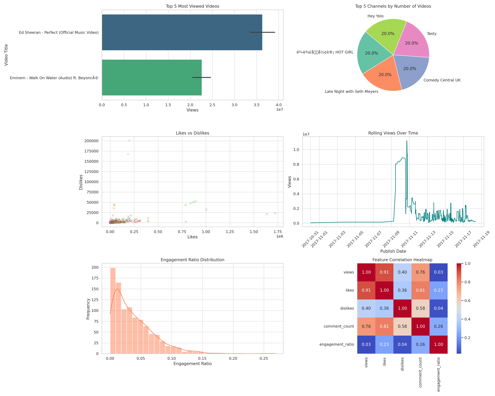

# Text-Data-Analysis

# YouTube Analysis 📈 🔍

Understand what makes YouTube content succeed—​from titles and tags to sentiment, emojis, and engagement.  
This repository ships a self‑contained Jupyter Notebook, **`youtube_analysis.ipynb`**, that walks you through:

1. Loading raw CSV data exported from the YouTube API or other sources  
2. Performing sentiment analysis on video titles/descriptions  
3. Generating word‑cloud and emoji frequency visualizations  
4. Exploring category‑level insights (likes, views, trending frequency, etc.)  
5. Exporting your cleaned/annotated dataset to **CSV, JSON, or SQLite**  
6. Answering 10+ business questions such as  
   - *Which category earns the most likes?*  
   - *Are audiences truly engaged?*  
   - *Do punctuation marks in titles/tags correlate with performance?*
--- 
  
 ## Features 
  
 - **Interactive Visualizations:** Charts, graphs, and KPIs to track trends in YouTube content performance. 
 - **Country & Category Insights:** Analyze YouTube growth by region and video genre. 
 - **Engagement Metrics:** Monitor likes, comments, and shares to identify high-engagement content. 
 - **Top Channels & Videos:** Identify the most influential channels and viral videos of 2023. 
  
 --- 

### Dataset Includes: 
  
 - Country-wise YouTube statistics 
 - Popularity metrics (views, likes, comments, shares) 
 - Channel performance indicators 
 - Video category breakdowns 
  
 --- 

  
 ## Overview 
  
 This Power BI project provides an interactive dashboard for analyzing global YouTube statistics for 2023. It enables users to explore trends, top-performing content, and other key insights related to YouTube performance. 
  
 
  
 ---
